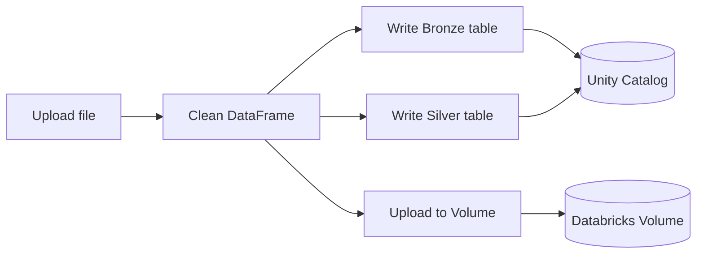

# flow-bricks

Medallion Data Lakehouse manager with Databricks API integration.


```mermaid
flowchart LR
    Upload[Upload file] --> Clean[Clean DataFrame]
    Clean --> Bronze[Write Bronze table]
    Clean --> Volume[Upload to Volume]
    Clean --> Silver[Write Silver table]
    Bronze --> Catalog[(Unity Catalog)]
    Silver --> Catalog
    Volume --> VolumeStore[(Databricks Volume)]
```

## Quick start

```bash
just dev
```

Copy `src/.env.example` to `src/.env` and fill in Databricks credentials.
